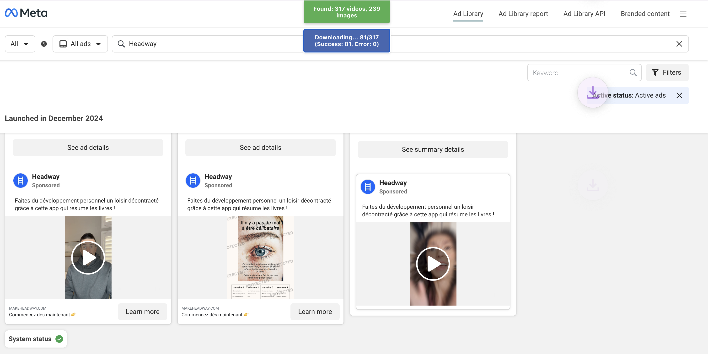

# Facebook Ads Video Downloader

A Chrome extension that allows you to download videos and images from the Facebook Ads Library.

## Features

- Download all videos from Facebook Ads Library pages
- Count available videos and images on the current page
- Real-time progress tracking of downloads
- Works with Facebook's dynamically loaded content
- Simple and intuitive interface

## How to Use

1. Install the extension in your Chrome browser
2. Navigate to [Facebook Ads Library](https://www.facebook.com/ads/library/)
3. Search for ads containing videos
4. Use the buttons at the top of the page:
   - **Count Videos**: Shows how many videos and images are available for download
   - **Download All Videos**: Starts downloading all available videos

## Installation

### From Chrome Web Store
*(Coming soon)*

### Manual Installation
1. Download the extension files
2. Go to `chrome://extensions/` in your Chrome browser
3. Enable "Developer mode" (toggle in the top-right corner)
4. Click "Load unpacked" and select the folder containing the extension files

## Technical Details

- Built with vanilla JavaScript
- Uses the Chrome Extensions Manifest V3
- Requires permissions for downloads, active tab, and Facebook Ads Library domain
- Detects and downloads videos even when they use complex or dynamic sources

## Privacy

This extension:
- Does not collect any user data
- Does not transmit any information to external servers
- Only interacts with content on the Facebook Ads Library pages
- All processing happens locally in your browser

## License

MIT License
